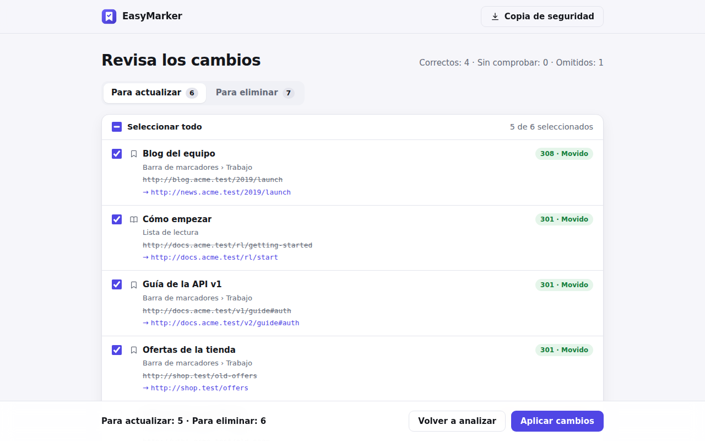

# EasyMarker

Extensión de Chrome que revisa los **marcadores** y la **lista de lectura** del perfil en el que está instalada y comprueba cada enlace:

- **Si el enlace ha cambiado** (redirige a otra dirección), propone actualizarlo.
- **Si el enlace ya no existe**, propone eliminarlo.
- **Si sigue funcionando**, lo deja como está.

Antes de tocar nada muestra una pantalla de revisión con dos listas, *Para actualizar* y *Para eliminar*. Puedes marcar o desmarcar cada elemento y, al final, confirmar los cambios.



## Cómo decide qué hacer con cada enlace

| Respuesta del sitio | Propuesta | ¿Marcado por defecto? |
| --- | --- | --- |
| `200`, o `401`/`403`/`429` (existe, pero pide sesión o limita) | Se deja como está | — |
| Redirección **permanente** `301`/`308`, o paso de `http` a `https` | Actualizar a la nueva dirección | Sí |
| Redirección **temporal** `302`/`303`/`307` (a menudo un login o una redirección por país) | Actualizar | No |
| Un enlace profundo que ahora lleva a la **portada** del sitio | Actualizar | No (suele significar que el contenido ya no está) |
| `404` No encontrado, `410` Eliminado, **dominio inexistente** | Eliminar | Sí |
| Error `5xx`, sin respuesta, no se puede conectar, certificado no válido… | Eliminar | No (puede ser un fallo pasajero) |
| Sin conexión, bloqueado por proxy o política | No se juzga: cuenta como *sin comprobar* | — |

Más detalles:

- En una cadena como `A → 301 → B → 302 → /login`, propone **B**: solo sigue la parte permanente de la cadena.
- Conserva el `#fragmento` del marcador (`/guia#instalar` → `/guia-nueva#instalar`).
- Cada dirección se comprueba una sola vez aunque esté en varios marcadores.
- Usa `HEAD` y, si falla, repite con `GET` (muchos servidores no admiten `HEAD`). Los errores de red se reintentan una vez.
- Se omiten los enlaces que no son web (`javascript:`, `chrome://`, `file://`…) y los marcadores gestionados por la organización.

## Seguridad y privacidad

- **Nada sale de tu navegador.** No hay servidores, analíticas ni código remoto. La única actividad de red son las propias peticiones a los enlaces que se comprueban.
- **Peticiones anónimas:** sin cookies (`credentials: 'omit'`), sin `Referer` y sin caché. Así no se usa tu sesión en ningún sitio ni se producen efectos secundarios.
- **Peticiones aisladas en un worker.** Muchas webs anuncian fuentes, estilos y scripts con cabeceras `Link: rel=preload`. Si la comprobación se hiciera desde la página, Chrome intentaría precargarlos dentro de la extensión; la CSP lo bloquearía, pero llenaría de errores `chrome://extensions`. Desde un worker esas cabeceras se ignoran y nunca se carga nada de los sitios comprobados.
- **Permisos mínimos.** El acceso a los sitios web (`http://*/*`, `https://*/*`) es *opcional*: Chrome lo pide la primera vez que pulsas *Analizar enlaces*, no al instalar. Los listeners de `webRequest` solo están activos durante un análisis y solo atienden las peticiones de la propia extensión.
- **CSP estricta** (`script-src 'self'`, `object-src 'none'`…). Los títulos y URLs se pintan siempre con `textContent`, nunca como HTML; ESLint lo vigila (`innerHTML` está prohibido).
- **Escritura defensiva:** antes de cambiar o borrar un elemento se vuelve a leer y, si ha cambiado desde el análisis, no se toca. Nunca se guarda una dirección que no sea `http(s)`.
- **Copia de seguridad** con un clic, en el formato estándar de marcadores (HTML), importable desde el administrador de marcadores de Chrome.

Política de privacidad: [PRIVACY.md](PRIVACY.md).

## Instalación

- **Desde la Chrome Web Store:** sigue la guía [docs/PUBLICAR.md](docs/PUBLICAR.md) para publicarla y luego instálala en cada perfil desde su enlace.
- **Para desarrollo (sin tienda):**
  1. Abre `chrome://extensions`.
  2. Activa el **Modo de desarrollador** (arriba a la derecha).
  3. Pulsa **Cargar descomprimida** y elige la carpeta `extension/`.
  4. Pulsa el icono de EasyMarker en la barra de herramientas. Si no lo ves, está en el menú de extensiones (icono de puzzle).

Requiere Chrome 120 o posterior, por la API de la lista de lectura.

## Desarrollo

Necesitas Node.js 22.2 o posterior.

```bash
npm install                       # dependencias de desarrollo (ESLint, Playwright)
npx playwright install chromium   # solo la primera vez, para los tests E2E
npm run lint                      # ESLint
npm test                          # tests unitarios (node:test)
npm run test:e2e                  # carga la extensión en Chromium y la prueba contra un servidor local
npm run package                   # genera dist/easymarker-<versión>.zip para la Chrome Web Store
npm run icons                     # regenera los iconos y la imagen promocional
```

El test E2E crea marcadores y entradas de la lista de lectura en un perfil temporal. Los comprueba contra un servidor local que simula redirecciones `301/302/308`, errores `404/410/503` y un dominio inexistente. Después aplica una selección y verifica el resultado. Con `npm run test:e2e -- --screenshots` regenera las capturas de `store/`.

No hay paso de compilación: la carpeta `extension/` es exactamente lo que se publica.

```
extension/
  manifest.json        Manifest V3
  background.js        abre (o enfoca) la pestaña de la app al pulsar el icono
  app.html, css/       interfaz
  js/app.js            controlador de la interfaz: inicio → análisis → revisión → hecho
  js/collect.js        recoge marcadores y lista de lectura
  js/checker.js        comprueba los enlaces (fetch + webRequest para ver cada redirección)
  js/fetch-worker.js   hace las peticiones fuera de la página (ver «Seguridad y privacidad»)
  js/classify.js       decide qué proponer para cada enlace (lógica pura, con tests)
  js/pool.js           concurrencia limitada (8 en total, 2 por sitio)
  js/apply.js          aplica los cambios confirmados
  js/backup.js         exporta la copia de seguridad
  _locales/es, en/     textos en español (por defecto) e inglés
test/unit/             tests unitarios
test/e2e/              test de extremo a extremo con Playwright
scripts/               empaquetado e iconos
store/                 imágenes para la ficha de la Chrome Web Store
docs/PUBLICAR.md       guía de publicación paso a paso
```
